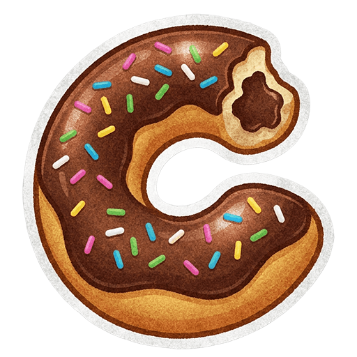

  

  
  
  
  

  <b>Leia este documento em outro idioma: <a href="README.md">English</a></b>

# qCodelicious

Um simples editor de código.

## Links

* **Website / Demo:** [https://rafaelsouzars.github.io/qcodelicious/](https://rafaelsouzars.github.io/qcodelicious/)
* **Repositório:** [https://github.com/rafaelsouzars/qcodelicious/tree/dev](https://github.com/rafaelsouzars/qcodelicious/tree/dev)

## Frameworks e Bibliotecas

* [ElectroBun](https://blackboard.sh/electrobun/)
* [Ace Editor](https://ace.c9.io)
* [SweetAlert2](https://sweetalert2.github.io)
* [Material UI](https://mui.com)

## Agradecimentos

Um agradecimento especial à equipe do Electrobun e ao Yoav, fundador da [Blackboard Technology](https://blackboard.sh/), por toda a atenção e suporte fornecidos.